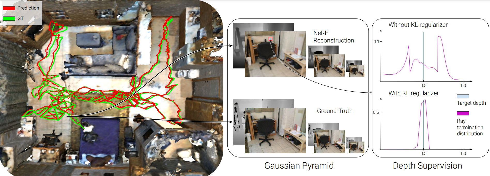

# SLAIM

Official code release for the paper:

> **[SLAIM: Robust Dense Neural SLAM for Online Tracking and Mapping]** <br />
> *[Vincent Cartillier](https://vincentcartillier.github.io/), Grant Schindler, Irfan Essa* <br />
> Neural Rendering Intelligence workshop CVPR 2024 <br />


[[Project page](https://vincentcartillier.github.io/slaim.html)], [[arXiv](https://arxiv.org/abs/2404.11419)]




```bibtex
@inproceedings{cartillier2024slaim_cvpr_nri_24,
  title={SLAIM: Robust Dense Neural SLAM for Online Tracking and Mapping},
  author={Cartillier, Vincent and Schindler, Grant and Essa, Irfan},
  booktitle = {CVPR(NRI)},
  year={2024}
}

@article{cartillier2024slaim,
  title={SLAIM: Robust Dense Neural SLAM for Online Tracking and Mapping},
  author={Cartillier, Vincent and Schindler, Grant and Essa, Irfan},
  journal={arXiv preprint arXiv:2404.11419},
  year={2024}
}
```


Code tested on a single A40 node (Ubundu 20, cuda 11.3) <br />

## Setup
1. Clone SLAIM
```bash
git clone --recursive https://github.com/vincentcartillier/SLAIM
cd SLAIM
# git submodule update --init --recursive
```

2. Create a conda environment,
```bash
conda create -n slaim python=3.7
conda activate slaim
pip install -r requirements.txt
```

3. Install Instant-NGP.  <br />
You will need GCC/G++ 8 or higher, cmake v3.21 or higher and cuda 10.2 or higher. Please check the [main repo](https://github.com/NVlabs/instant-ngp) for more details.


```bash
cd dependencies/instant-ngp
cmake -DCMAKE_C_COMPILER=gcc -DCMAKE_CXX_COMPILER=g++ -DNGP_BUILD_WITH_GUI=off . -B build -DCMAKE_BUILD_TYPE=RelWithDebInfo
cmake --build build --config RelWithDebInfo -j
```

Note: I had to manully link GLEW in the CMakeLists.txt (L180). If you already have GLEW installed this shouldn't be needed. Check the CMakeLists.txt from main repo for reference.

```
[...(L180)]
if (MSVC)
	list(APPEND NGP_INCLUDE_DIRECTORIES "dependencies/gl3w")
	list(APPEND GUI_SOURCES "dependencies/gl3w/GL/gl3w.c")
	list(APPEND NGP_LIBRARIES opengl32 $<TARGET_OBJECTS:glfw_objects>)
else()
	find_package(GLEW REQUIRED)
    set(GLEW_INCLUDE_DIRS "/nethome/vcartillier3/lib/glew-2.1.0/build/cmake/install/include")
    set(GLEW_LIBRARIES "/nethome/vcartillier3/lib/glew-2.1.0/build/cmake/install/lib/libGLEW.so")
	list(APPEND NGP_INCLUDE_DIRECTORIES ${GLEW_INCLUDE_DIRS})
	list(APPEND NGP_LIBRARIES GL ${GLEW_LIBRARIES} $<TARGET_OBJECTS:glfw_objects>)
endif()
```

## Data

### Download
* ScanNet:
Please follow the data downloading procedure on [ScanNet](http://www.scan-net.org/) website, and extract color/depth frames from the `.sens` file using this [code](https://github.com/ScanNet/ScanNet/blob/master/SensReader/python/reader.py). <br />
Place the data under `./Datasets/scannet/scans/scene0000_00/frames`

* Replica:
Use the following script to download the data. Data is saved under `./Datasets/Replica`. We use the same trajectories and scenes as in iMAP, NICE-SLAM, Co-SLAM etc...
```bash
bash scripts/download_replica.sh
```

* TUM RGB-D:
Use the following script to download the data. Data is saved under `./Datasets/TUM-RGBD`.
```bash
bash scripts/download_tum.sh
```

### Pre-process
The following steps show how to pre-process the data for a given scene.


## Demo


## Workflow


